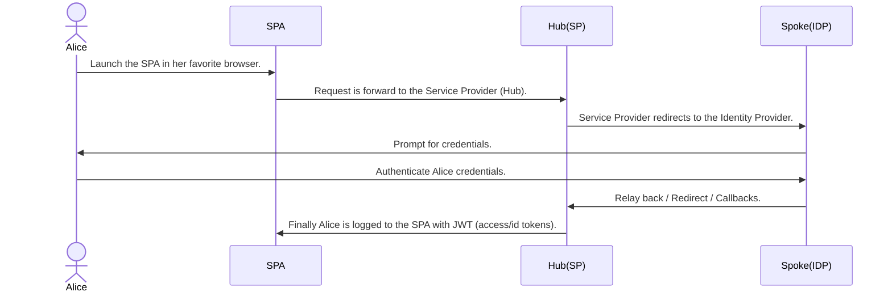

# Okta Terraform Hub and Spoke with OpenId Connect

Terraform Hub and Spoke with OIDC is my attempt reduce the complexity when it comes to the Hub & Spoke architecture and
configuration particular between two Okta tenants, one acting as
Hub (Service Provider), and the other acting as the Spoke (Identity Provider).

__TL;DR:__

- :warning: Do not use on production tenant.:warning:
- Complete configuration of Hub & Spoke with OpenID Connect done via Terraform & Okta Provider.
- Hub and Spoke with two custom attributes at the `appuser` level demonstrating JIT.
  - `favoriteColor` simple String Data Type.
  - `subscriptionLevel` simple String Enum Data.
  - `favoriteMusic` simple String Data Type.

## End user flow sequence diagram



## Requirements

- Terraform v1.3.3.
- Okta Provider v3.37.0.
- Two Okta tenants, one representing the Hub and the other representing the Spoke.
- `tfenv` Optional, but recommended to manage different version of the `terraform` cli.
- NodeJS v16.17.0 and with `npm`.
- `nvm` Optional, but recommend to manage different version of node.

## Getting started

### Set up your `okta.auto.tfvars` file with Okta API Tokens.

> **NOTE:** Assuming you have already created or have to two Okta tenants

- Copy `okta.auto.tfvars-sample` to `okta.auto.tfvars` file.

    ```bash
    cp okta.auto.tfvars-sample okta.auto.tfvars
    ```

- Get your API Token and past it into the `okta.auto.tfvars` file.

    ```vim
    # Inside the okta.auto.tfvars file.
    okta_spoke_org_name  = "narisaklabs-spoke"
    okta_spoke_base_url  = "oktapreview.com"
    okta_spoke_api_token = "00Y...kx8"

    okta_hub_org_name  = "narisaklabs-hub"
    okta_hub_base_url  = "oktapreview.com"
    okta_hub_api_token = "00K...VuJ"
    ```

- Provision your Okta tenants.

  > **NOTE:** `-auto-approve` deactivates user interaction prompts.

    ```cli
    terraform init
    terraform validate
    terraform plan
    terraform apply -auto-approve
    ```

    or

    ```cli
    # One-liner
    terraform init && terraform validate && terraform plan && terraform apply -auto-approve
    ```

- Couple actions happen
  - Both Okta tenants have been provision for Hub and Spoke integration.
  - `testenv` containing the **ISSUER** and **CLIENT_ID** that is generated by Terraform and moved to the `react-app/` folder.

- Test it!

  ```cli
  cat react-app/testenv  # Display the configuration value.
  # ie.
  # ISSUER=https://narisaklabs-hub.oktapreview.com/oauth2/default
  # CLIENT_ID=0oa...p1d7

  # Navigate to react-app/okta-hosted-login
  cd react-app/okta-hosted-login
  npm install
  npm start

  # Launch your favorite browser, ideally Incognito Mode.
  open http:/localhost:8080
  ```

  **NOTE:** I assume you have an existing user account on the Spoke tenant.

  1. Log in with user credentials.
  2. See that Hub directs

- Cleanup.

  > **NOTE:** `-auto-approve` deactivates user interaction prompts.

  > **NOTE:** `-parallelism=1` set to `1` current process, by default terraform has 10 default process out of the box and we setting to `1` so we can control the destroy process with consistency, i.e. order of executions.

  ```cli
  terraform destroy -auto-approve -parallelism=1
  ```

## Tips & Gotchas

- On "`terraform destroy -auto-approve`" you get the following error or something similar with in the user schema property.

  ```bash
  ...
  module.hub.okta_app_oauth.spa_application: Destruction complete after 0s
  ╷
  │ Error: failed to delete user schema property favoriteColor: the API returned an error: Api validation failed: updateUserSchemas. Causes: errorSummary: Property favoriteColor cannot be deleted. It is used to populate oidc_client_8c73i16.favoriteColor., errorSummary: Property favoriteColor cannot be deleted. It is used to populate oidc_client_8c73i16.favoriteColor.
  │
  │
  ╵
  ...
  ```

  Re-execute "`terraform destroy -auto-approve`" should resolve it. There is race conditional that is tied to the custom schema and the mapping that is done on that custom schema attribute. Okta API endpoints, particularly when to HTTP DELETES calls are place into queue to be remove from the tenant.

- On "`terraform apply -auto-approve`" fails, perform `terraform refresh` and then `terraform apply -auto-approve`. Again due to the nature of Okta API endpoints are asynchronous processed, i.e. HTTP POST | PUT | DELETE calls are place on queue and HTTP 2XX response just means the request was received but the actual action may have not been updated in the backend.

## Resources

- [Okta to Okta: Enterprise Identity Provider](https://developer.okta.com/docs/guides/add-an-external-idp/oktatookta/main/)
- [Okta For Global Distributed Organizations](https://www.okta.com/resources/whitepaper/okta-for-global-distributed-organizations/)
