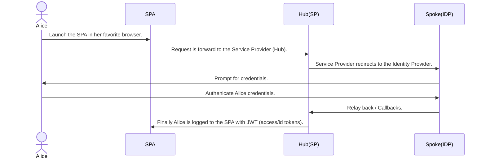

# Okta Terraform Hub and Spoke with OpenId Connect

Terraform Hub and Spoke with OIDC demo since it is pretty complex step between to Okta tenants, one acting as
Hub (Service Provider), and the other acting as the Spoke (Identity Provider).

## End user flow sequence diagram



## Requirements

- Terraform v1.3.3.
- Okta Provider v3.37.0.
- Two Okta tenants, one representing the Hub and the other representing the Spoke.
- `tfenv` Optional, but recommended to manage different version of the `terraform` cli.
- NodeJS v16.17.0 and with `npm`.
- `nvm` Optional, but recommend to manage different version of node.

## Getting started

### Set up your `okta.auto.tfvars` file with Okta API Tokens.

> NOTE: Assuming you have already created or have to two Okta tenants

- `cp okta.auto.tfvars-sample okta.auto.tfvars`
- Get your API Token and past it into the `okta.auto.tfvars` file.

    ```vim
    # Inside the okta.auto.tfvars file.
    okta_spoke_org_name  = "narisaklabs-spoke"
    okta_spoke_base_url  = "oktapreview.com"
    okta_spoke_api_token = "00Y...kx8"

    okta_hub_org_name  = "narisaklabs-hub"
    okta_hub_base_url  = "oktapreview.com"
    okta_hub_api_token = "00K...VuJ"
    ```

- Provision your Okta tenants.

    ```cli
    $ terraform init
    $ terraform validate
    $ terraform plan
    $ terraform apply -auto-approve     # '-auto-approve' flag, if you do not want to be prompted by the cli.
    ```

    or

    ```cli
    # One-liner
    $ terraform init && terraform validate && terraform plan && terraform apply -auto-approve
    ```

- Couple actions happen
  - Both Okta tenants have been provision for Hub and Spoke integration.
  - `testenv` containing the ISSUER and SPA CLIENT_ID that generated by the provisioning.

- Test it!

  ```cli
  $ cd react-app
  $ cat testenv  # Display the configuration value.
  $ npm install
  $ npm start
  ```

- Cleanup.

  ```cli
  $ terraform destroy -auto-approve # '-auto-approve' flag, if you do not want to be prompted by the cli.
  ```

## Resources

- [Okta to Okta: Enterprise Identity Provider](https://developer.okta.com/docs/guides/add-an-external-idp/oktatookta/main/)