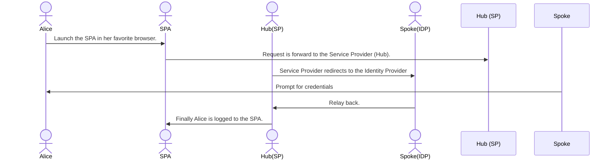

# Okta Terraform Hub and Spoke with OpenId Connect

Terraform Hub and Spoke with OIDC demo since it is pretty complex step between to Okta tenants, one acting as
Hub (Service Provider), and the other acting as the Spoke (Identity Provider).

## End user flow sequence diagram



## Requirements

- Terraform v1.3.3
- Okta Provider v3.37.0
- Two Okta tenants
- `tfenv` Optional, but recommended to manage different version of the `terraform` cli.

## Getting started

### Set up your `okta.auto.tfvars` file with Okta API Tokens.

> NOTE: Assuming you have already created or have to two Okta tenants

- `cp okta.auto.tfvars-sample okta.auto.tfvars`
- Get your API Token and past it into the `okta.auto.tfvars` file.

    ```vim
    # Inside the okta.auto.tfvars file.
    okta_spoke_org_name  = "narisaklabs-spoke"
    okta_spoke_base_url  = "oktapreview.com"
    okta_spoke_api_token = "00Y...kx8"

    okta_hub_org_name  = "narisaklabs-hub"
    okta_hub_base_url  = "oktapreview.com"
    okta_hub_api_token = "00K...VuJ"
    ```

- Provison your Okta tenants.

    ```cli
    $ terraform init
    $ terraform validate
    $ terraform plan
    $ terraform apply -auto-approve # if you do not want to be prompted by the cli.
    ```

- Cleanup.

  ```cli
  $ terraform destroy -auto-approve # If you do not want to be prompted by the cli.
  ```

## Take away

- Hub configuration
- Spoke configuration
- React SPA with Redirect Model flow

```mermaid
person -> spoke (idp) --> hub (sp)
```

# TODO

- ~~Convert the Hub okta resources to HCL~~